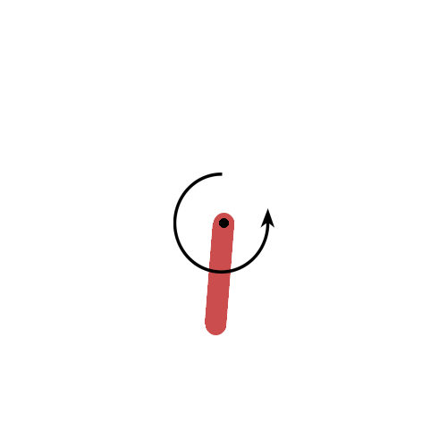

# Pendulum Control with Reinforcement Learning

This project demonstrates the use of reinforcement learning to control an
inverted pendulum. The objective is to swing up the pendulum and balance it. The
project previously implemented a DDPG algorithm, and this version implements a
TD3 algorithm.



One interesting strategy we see from the above animation is that the agent doesn't put the pendulum straight up, but rather slightly angled right. This is likely because applying alternating torque is more difficult than applying constant small torque.

## Features

- Trains an agent to balance an inverted pendulum
- Visualizes the trained agent's performance
- Optionally saves episode animations as GIFs

## Requirements

- Python 3.11+
- [Poetry](https://python-poetry.org/)

## Usage
To install the dependencies, run:

```bash
poetry install
```

To train the agent, run:
```bash
python pendulum.py
```

To visualize the trained agent, run:
```bash
python play_pendulum.py
```
